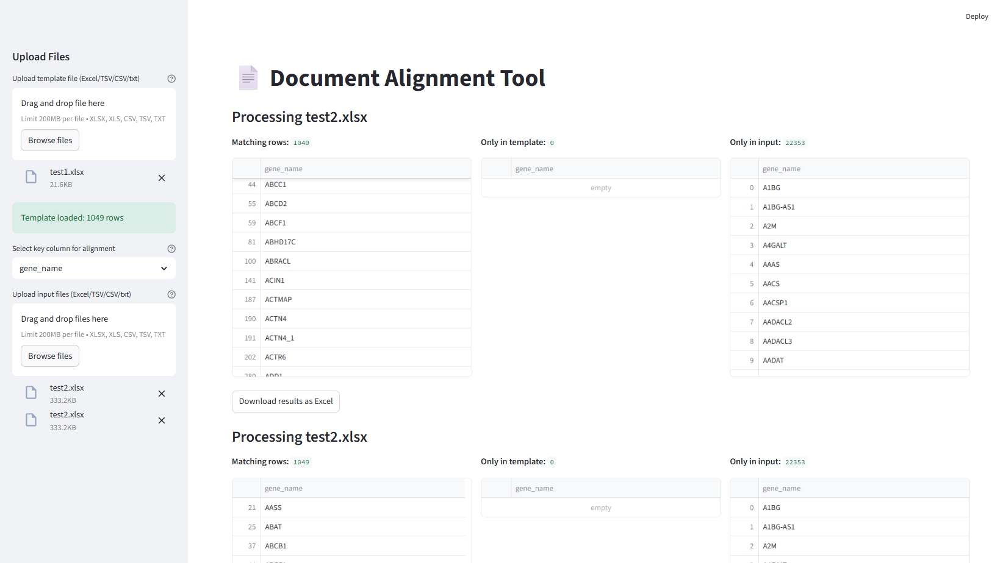

# Alignment tool
A simple project using streamlit as the platform to align the different data from two files, based on one matched column.

## Overview 
This tool acepts one template file(.xlsx,.xls, .csv, .txt, .tsv) and multiple input files. It can align the data from template and input based on one column which the user choosed. Result will be a excel file with three sheets(matched, only in template, only in input)

## Installation (recommended)
``` bash
git clone https://github.com/farm110/alignment_tool.git

cd alignment_tool
# create a virtual environment
python -m venv cleanenv
# activate the venv
# Git Bash:
source cleanenv/Scripts/activate
# CMD:
cleanenv\Scripts\activate.bat
# PowerShell:
.\cleanenv\Scripts\Activate.ps1
# ensure pip from this venv is used
python -m pip install --upgrade pip
python -m pip install -r requirements.txt
```
## Usage
```bash
streamlit run app.py

```
----Make sure the column you want to match is unique across all files and has the same column name.

----Upload the template and input files.

----Select the column name for matching.

----Wait for the alignment to finish

----Download the results

## Example


## Known issues
----If your excel file have multiple sheets, it only works on the first one
